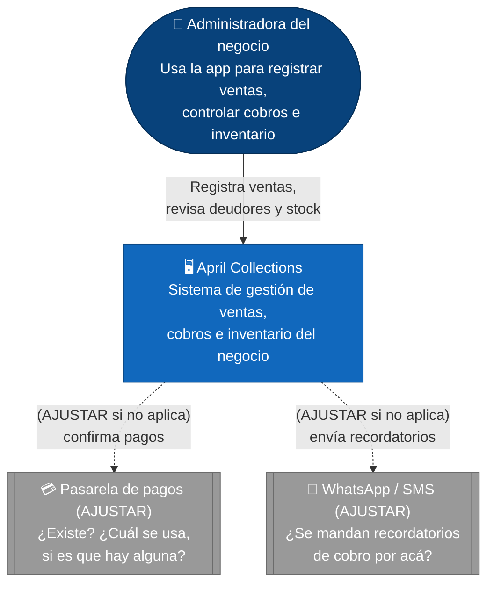
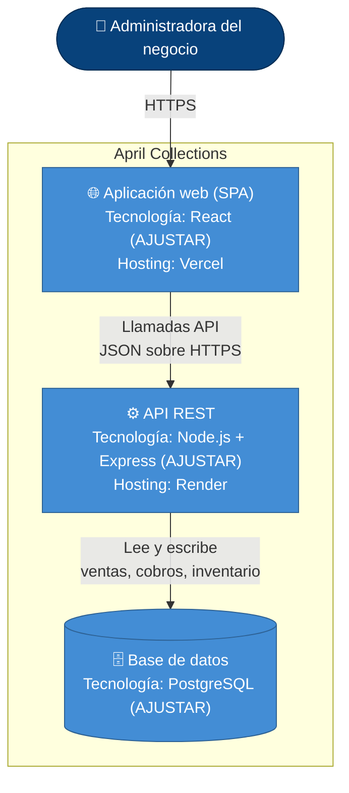

# Arquitectura — April Collections (C4)

> **Nota sobre este borrador:** las partes marcadas con **(AJUSTAR)** son
> supuestos que hizo la IA porque no tenía el dato real (stack técnico,
> integraciones externas). Corregilas por lo que realmente usa el proyecto
> y anotá qué cambiaste en la sección "Correcciones" al final de este
> archivo — eso es parte de lo que pide la práctica.

## Nivel 1 — Diagrama de contexto

Actores, el sistema y con qué otros sistemas externos interactúa.

### Decisión 1 — Sin portal de autoservicio para clientes finales

Elegí que April Collections sea una herramienta de uso exclusivo para la
administradora del negocio, sin un portal público donde los clientes
puedan ver sus propias deudas o pagar en línea, porque prioricé
**mantenibilidad y seguridad** sobre alcance de funcionalidades. Al ser un
negocio familiar de bajo volumen, sumar autenticación multi-rol y una
superficie pública adicional no se justifica frente al riesgo extra
(datos de ventas y clientes expuestos a más gente). La contrapartida es
que los clientes no se autogestionan, pero para este contexto priorizo
simplicidad operativa sobre disponibilidad de autoservicio. **(AJUSTAR si
en realidad sí hay un acceso para clientes.)**

## Nivel 2 — Diagrama de contenedores

Los contenedores (aplicaciones/servicios desplegables) que componen el
sistema, con su tecnología.

### Decisión 2 — Frontend y backend como contenedores separados

Elegí separar el frontend (SPA) del backend (API REST) en dos contenedores
desplegados de forma independiente (Vercel para el frontend, Render para
el backend) en vez de un monolito, porque prioricé **disponibilidad y
capacidad de despliegue continuo** sobre la simplicidad de un solo
servicio: en la Práctica 2 elegí trunk-based development justamente para
desplegar seguido, y eso exige poder actualizar la interfaz sin reiniciar
el servicio que tiene los datos. El costo es más complejidad operativa
(dos despliegues, manejo de CORS) frente a un monolito, pero para este
proyecto priorizo mantenibilidad a largo plazo por sobre esa simplicidad
inicial. **(AJUSTAR si en realidad todo corre en un solo servicio, o si
usás otro proveedor de hosting.)**

## Correcciones que hice al borrador de la IA
Eliminé la pasarela de pagos porque el sistema no procesa pagos en línea.
Eliminé el nodo de WhatsApp/SMS porque no se envían recordatorios automáticos.
Cambié el frontend: en vez de React, usamos Vue.js y está desplegado en Netlify.
Cambié el backend: en vez de Node.js + Express, usamos Django y está en Railway.
Cambié la base de datos: en vez de PostgreSQL, usamos MySQL.
Ajusté la Decisión 1: sí existe un portal de clientes para ver deudas, así que lo incluí en el contexto.
Ajusté la Decisión 2: todo corre en un solo servicio monolítico (Django), no en contenedores separados.
