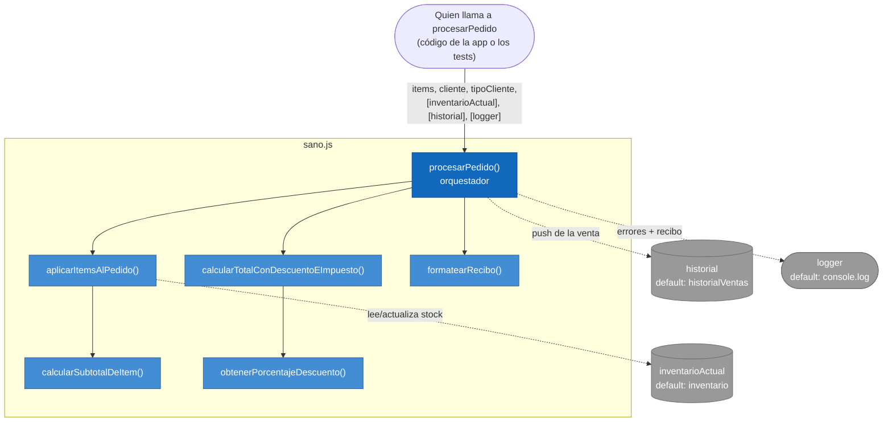

# Diagnóstico — Práctica 5

## Código original

`practica-5/enfermo.js` simula un fragmento real del sistema de pedidos de
**Pulpería La Esquina**: recibe una lista de ítems, valida stock, calcula el
total con descuento por tipo de cliente e impuesto, actualiza el inventario,
registra la venta y muestra el recibo por consola — todo en una sola función.

```javascript
function procesarPedido(items, cliente, tipoCliente) {
  let total = 0;
  let detalle = "";
  for (let i = 0; i < items.length; i++) {
    let p = items[i];
    if (!inventario[p.nombre]) {
      console.log("Producto no existe: " + p.nombre);
      continue;
    }
    if (inventario[p.nombre].stock < p.cantidad) {
      console.log("Sin stock suficiente para " + p.nombre);
      continue;
    }
    let subtotal = inventario[p.nombre].precio * p.cantidad;
    total = total + subtotal;
    detalle = detalle + p.nombre + " x" + p.cantidad + " = " + subtotal + "\n";
    inventario[p.nombre].stock = inventario[p.nombre].stock - p.cantidad;
  }

  if (tipoCliente === "mayorista") {
    if (total > 500) { total = total - total * 0.15; }
    else { total = total - total * 0.05; }
  } else if (tipoCliente === "frecuente") {
    if (total > 500) { total = total - total * 0.1; }
    else { total = total - total * 0.03; }
  }

  total = total + total * 0.15;

  historialVentas.push({ cliente: cliente, total: total, fecha: new Date() });

  console.log("=== RECIBO ===");
  console.log(detalle);
  console.log("TOTAL: " + total.toFixed(2));
  console.log("Cliente: " + cliente);

  return total;
}
```

## Tabla: problema → principio violado → refactor aplicado

| # | Problema en `enfermo.js` | Principio violado (número) | Refactor aplicado en `sano.js` |
|---|---|---|---|
| 1 | Una sola función valida stock, calcula subtotales, aplica descuento e impuesto, actualiza inventario, guarda historial e imprime el recibo. | M1 #1 — Long Method · SOLID 1 — Single Responsibility Principle | Se extrajeron `calcularSubtotalDeItem`, `aplicarItemsAlPedido`, `obtenerPorcentajeDescuento`, `calcularTotalConDescuentoEImpuesto` y `formatearRecibo`. `procesarPedido` quedó como orquestador de esos pasos (commits `refactor: early return...` y `refactor: separar responsabilidades...`). |
| 2 | La lógica de negocio (cálculo de totales) está entrelazada con efectos de salida (`console.log`) dentro del mismo bucle y al final de la función. | M1 #2 — Mixed concerns · SOLID 1 — SRP | `aplicarItemsAlPedido` y las funciones de cálculo son puras (sin `console.log`); la impresión se aisló en `formatearRecibo` (devuelve texto) y en el parámetro `logger` de `procesarPedido`, que decide *cuándo* imprimir sin que el cálculo lo sepa. |
| 3 | Números sin explicar: `500` (umbral), `0.15`/`0.05` (mayorista), `0.1`/`0.03` (frecuente), `0.15` (impuesto). | M1 #3 — Magic number | Se nombraron como `TASA_IMPUESTO`, `UMBRAL_DESCUENTO_ALTO` y la tabla `DESCUENTOS_POR_TIPO_CLIENTE` (commit `refactor: extraer números mágicos...`). |
| 4 | Variables abreviadas (`p`, `i`, `s` implícito en el índice) que exigen releer el contexto para entender qué representan. | M1 #4 — Nombres poco descriptivos | Se reemplazó el `for` indexado por `for (const item of items)`, eliminando el índice `i` y renombrando `p` a `item` (commit `refactor: renombrar variables abreviadas...`). |
| 5 | El bloque `if/else` de descuento para `"mayorista"` y `"frecuente"` repite la misma estructura (umbral > 500 → tasa alta, si no → tasa baja); agregar un tercer tipo de cliente obliga a copiar el bloque de nuevo y editar la función. | M1 #5 — Repetición de código · SOLID 2 — Open/Closed Principle | Se reemplazó el `if/else` duplicado por la tabla de datos `DESCUENTOS_POR_TIPO_CLIENTE` y la función `obtenerPorcentajeDescuento`. Agregar un tipo de cliente nuevo (ej. `"vip"`) ahora es agregar una fila a la tabla, sin tocar la lógica ya escrita ni volver a probarla. |
| 6 | Los casos de error ("producto no existe", "sin stock") solo se comunican imprimiendo por consola y `continue`; quien llama a `procesarPedido` no tiene forma programática de saber qué falló. Además la función depende directamente de las variables globales `inventario` y `historialVentas`, y de `console.log` como implementación fija. | M1 #6 — Falta de manejo de errores · SOLID 5 — Dependency Inversion Principle | `calcularSubtotalDeItem` devuelve `{ ok, motivo }` de forma explícita en vez de solo loguear; `aplicarItemsAlPedido` acumula esos motivos en `errores` y se los devuelve a quien la llama. `procesarPedido(items, cliente, tipoCliente, inventarioActual = inventario, historial = historialVentas, logger = console.log)` recibe sus dependencias como parámetros con esos mismos valores por defecto, así el comportamiento no cambia para quien ya la usaba, pero ahora se puede inyectar un inventario de prueba o un logger que junte los mensajes en un arreglo en vez de imprimir. |

## Diagrama de la estructura final (sano.js)

Cómo quedó `procesarPedido` como orquestador de funciones pequeñas y puras,
con sus tres dependencias inyectables (inversión de dependencias, problema
#6 de la tabla de arriba):



Cada caja azul clara es una función pura con una sola responsabilidad
(SRP). Las tres cajas grises no son módulos concretos fijos: son
parámetros con valor por defecto, así que quien llama a `procesarPedido`
puede inyectar su propio inventario, historial o logger de prueba sin
tocar el código de `sano.js` (DIP).


## Qué se mantuvo igual a propósito

La firma pública `procesarPedido(items, cliente, tipoCliente)` sigue funcionando
exactamente igual que antes (los tres parámetros nuevos son opcionales con
valores por defecto). Por eso `practica-5/sano.test.js` — escrito una sola vez,
en el commit que crea `sano.js` — no tuvo que modificarse en ningún commit
posterior de refactor: los mismos 8 casos siguen en verde de punta a punta,
que es la evidencia de que el comportamiento externo no cambió aunque el
código interno sí.

## Cómo correr los tests

```bash
node practica-5/enfermo.test.js   # comportamiento "antes" (no se toca)
node practica-5/sano.test.js      # mismo comportamiento, código refactorizado
```
