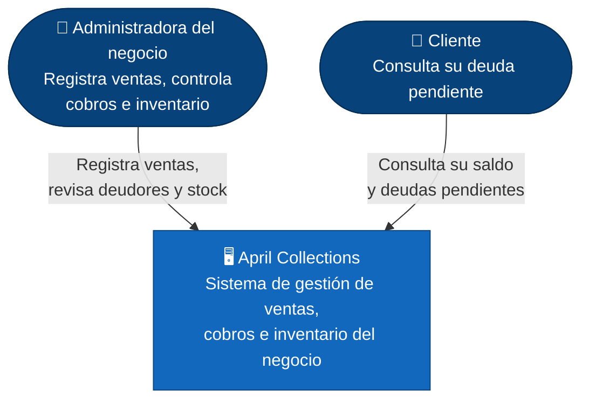
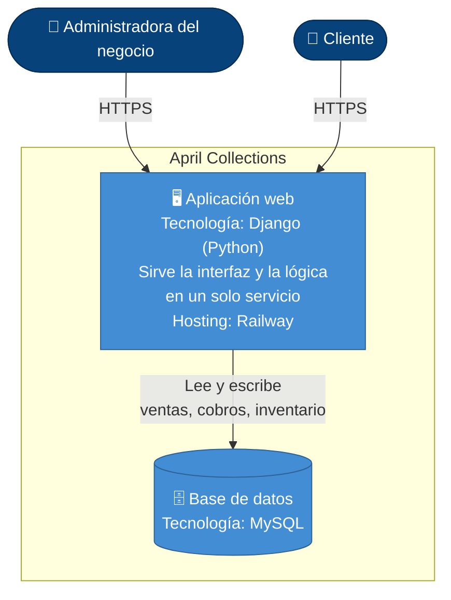

# Arquitectura — April Collections (C4)

> Este diagrama fue corregido a partir de un primer borrador generado con
> IA, que tenía tecnologías inventadas (React, Node.js + Express,
> PostgreSQL, Vercel/Render) y una integración de pasarela de pagos que no
> existe. Los cambios reales están listados en "Correcciones" al final.

## Nivel 1 — Diagrama de contexto

### Decisión 1 — Portal de consulta para el cliente, sin pasarela de pagos

Los clientes pueden ver su deuda pendiente dentro del sistema, pero el
pago en sí se sigue registrando manualmente por la administradora, sin
una pasarela de pagos en línea integrada. Prioricé **transparencia y
experiencia del cliente** (poder consultar cuánto debe sin tener que
llamar) por sobre la complejidad y el riesgo de seguridad de integrar
cobros con tarjeta (cumplimiento de estándares de pago, manejo de datos
sensibles). Es un punto intermedio: el cliente ve, pero no paga en línea
todavía.

## Nivel 2 — Diagrama de contenedores

### Decisión 2 — Un solo contenedor (monolito) en vez de frontend y backend separados

Django sirve tanto la interfaz como la lógica de negocio en un único
servicio desplegado en Railway, en vez de separar un frontend y un
backend como servicios independientes. Prioricé **simplicidad de
despliegue y mantenimiento** — un solo servicio para actualizar y
monitorear, sin manejo de CORS ni versiones de API que sincronizar entre
dos partes — por sobre la escalabilidad independiente que ofrecería
separarlos. Dado el volumen bajo de tráfico de un negocio familiar, la
complejidad operativa extra de dos servicios no se justifica frente al
beneficio.

## Correcciones que hice al borrador de la IA

- Eliminé la pasarela de pagos: el sistema no procesa pagos en línea, el
  cliente solo consulta su deuda.
- Eliminé el nodo de WhatsApp/SMS: no se envían recordatorios automáticos.
- Agregué al Cliente como actor de nivel 1: sí existe un portal para que
  consulte su deuda pendiente, algo que no estaba en el borrador original.
- Cambié la tecnología del backend: en vez de Node.js + Express, es
  Django (Python), desplegado en Railway.
- Cambié la base de datos: en vez de PostgreSQL, es MySQL.
- Cambié la arquitectura de contenedores: no hay un frontend separado (ni
  React ni Vue.js) — Django sirve todo en un solo servicio (monolito), no
  en contenedores independientes de frontend y backend como proponía el
  borrador.
