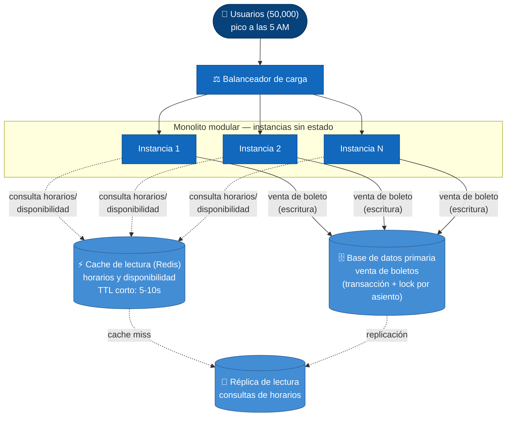

# ADR-001: Arquitectura para el crecimiento del sistema de venta de boletos

**Estado:** Aceptado

## Contexto

El sistema de venta de boletos de la cooperativa de buses (capstone SE1)
creció a **50,000 usuarios**. El patrón de tráfico tiene una particularidad
importante: hay un **pico diario a las 5 AM**, cuando se liberan los
boletos del día y una gran cantidad de usuarios consulta horarios y
disponibilidad de asientos casi al mismo tiempo, y una fracción de ellos
compra. El gerente pidió evaluar "microservicios porque lo leyó en
LinkedIn" — esta ADR evalúa esa opción junto a otras dos, con los mismos
criterios, para decidir con trade-offs y no con moda.

### Atributos de calidad priorizados (y por qué)

- **Consistencia de datos** — el riesgo de negocio más caro es vender el
  mismo asiento dos veces. Cualquier arquitectura elegida tiene que hacer
  esto fácil de garantizar, no difícil.
- **Rendimiento y disponibilidad bajo picos** — el tráfico no es parejo:
  es mayormente lectura repetida (horarios, disponibilidad) concentrada en
  una ventana corta cada mañana. La arquitectura tiene que absorber ese
  pico sin degradarse ni sobre-aprovisionar el resto del día.
- **Simplicidad operativa** — el equipo que mantiene esto es chico (un
  equipo de capstone/cooperativa, no varias escuadras independientes). La
  arquitectura no debería exigir más operación de la que el equipo puede
  sostener.
- **Costo** — 50,000 usuarios con un pico diario acotado no justifica una
  infraestructura pensada para tráfico sostenido a gran escala.

### Atributos que conscientemente NO se priorizan (por ahora)

- **Aislamiento de fallos por dominio** (que un módulo caído no tumbe a
  los demás) y **despliegue independiente por equipo** — estos son los
  atributos que sí justificarían microservicios, pero no aplican: hay un
  equipo, no varios equipos que necesiten desplegar sin coordinarse entre
  sí.

## Opciones consideradas

### Opción A — Monolito modular

Un solo servicio desplegable, organizado internamente en módulos (ventas,
horarios, usuarios, notificaciones) con límites claros de código pero una
sola base de datos.

- **A favor:** la consistencia (no vender el mismo asiento dos veces) se
  resuelve con una transacción/lock dentro de una sola base de datos, sin
  necesidad de coordinación distribuida. Es más simple de operar, probar y
  depurar con un equipo chico. Agregar cache delante de las consultas de
  lectura (horarios, disponibilidad) es directo.
- **En contra:** no se puede escalar un módulo por separado del resto — si
  el módulo de notificaciones necesitara 50 veces más cómputo que el de
  ventas, tendría que escalar el monolito entero. Para 50,000 usuarios y
  el patrón de tráfico descrito, esta limitación no tiene evidencia de ser
  un problema real hoy.

### Opción B — Microservicios

Separar el sistema en servicios independientes (ventas, horarios,
usuarios, notificaciones, pagos) que se comunican por red.

- **A favor:** permite escalar cada servicio según su propia carga, y que
  equipos distintos desplieguen sin bloquearse entre sí. Aísla fallos: un
  servicio caído no tiene por qué tumbar a los demás.
- **En contra:** el problema de "no vender el mismo asiento dos veces"
  se vuelve mucho más difícil de garantizar cuando la disponibilidad y la
  venta viven en servicios distintos — hace falta una transacción
  distribuida o un patrón de saga, con más superficie para condiciones de
  carrera bajo el pico de las 5 AM, justo el momento más sensible. Además
  exige un equipo con experiencia operando N servicios (descubrimiento,
  observabilidad distribuida, versionado de contratos), algo que el equipo
  actual no tiene ni necesita para su volumen de tráfico. **No hay
  múltiples equipos ni dominios con ciclos de despliegue distintos que
  justifiquen pagar este costo** — la razón para elegirla ("es lo
  moderno") no es un trade-off, es moda.

### Opción C — Serverless (funciones + servicios gestionados)

Funciones que escalan automáticamente por invocación, sin servidores que
mantener, más servicios gestionados (base de datos, cola, cache).

- **A favor:** escala automáticamente ante el pico de las 5 AM sin
  aprovisionar de más el resto del día, y se paga por uso — atractivo para
  un tráfico tan irregular.
- **En contra:** el *cold start* de las funciones puede agregar latencia
  justo en el momento de más concurrencia, cuando la paciencia del usuario
  es menor. Igual que en microservicios, coordinar "no vender el mismo
  asiento dos veces" entre invocaciones stateless independientes exige
  mecanismos externos de lock/cola, con más piezas que aprender y depurar
  que una transacción local. El costo por invocación puede volverse
  impredecible si el tráfico sostenido crece más allá del pico puntual.

## Decisión

**Monolito modular**, con tres palancas de escala — y solo esas tres,
porque son las que responden a un problema real identificado en el
contexto:

1. **Balanceo de carga** con varias instancias sin estado de la
   aplicación, para absorber la concurrencia del pico de las 5 AM.
2. **Cache de lectura** (ej. Redis) delante de las consultas de horarios y
   disponibilidad, porque ese es el tráfico que se repite miles de veces
   por segundo durante el pico y no cambia a cada milisegundo.
3. **Réplica de lectura** de la base de datos, para separar las consultas
   repetidas de horarios de las escrituras críticas de venta.

Las ventas (la escritura que decrementa asientos disponibles) siguen
yendo directo a la base de datos primaria con una transacción/lock a
nivel de fila, para que la consistencia (no vender el mismo asiento dos
veces) no dependa de coordinación distribuida.

Se descartan microservicios y serverless para esta etapa porque ninguno
de los dos resuelve mejor el problema real (lectura repetida en un pico
predecible) y ambos empeoran el problema que más cuesta plata si sale
mal (vender el mismo asiento dos veces), a cambio de atributos
—aislamiento de fallos por dominio, despliegue independiente por
equipo— que esta cooperativa no necesita todavía.

## Consecuencias

Lo que se acepta perder al elegir monolito modular en vez de las otras
opciones:

- **Sin aislamiento de fallos por dominio.** Un bug grave en un módulo
  (ej. notificaciones) podría, en el peor caso, afectar la disponibilidad
  del resto del sistema. Se mitiga con buenas prácticas (manejo de
  errores, *feature flags*), pero el riesgo se acepta conscientemente.
- **Sin escalado independiente por módulo.** Si en el futuro un módulo
  necesita mucho más cómputo que los demás, va a escalar junto con todo
  el monolito, desperdiciando recursos en los módulos que no lo
  necesitan. Se acepta porque hoy no hay evidencia de que eso vaya a
  pasar.
- **Sin autonomía de despliegue por equipo.** Si el equipo crece a varias
  escuadras trabajando en paralelo, un monolito modular puede generar
  fricción de coordinación en el pipeline de CI/CD. Esta decisión se
  revisa si el tamaño del equipo cambia — no es permanente, es la mejor
  opción **para el contexto actual**.
- **El cache puede mostrar disponibilidad ligeramente desactualizada**
  (ej. "3 asientos" cuando ya se vendieron). Se mitiga con un TTL corto y
  con que la venta real siempre valida y bloquea contra la base de datos
  primaria, así nunca se vende de más aunque la lectura cacheada esté
  unos segundos desactualizada.

Esta ADR se revisita si cambia alguno de los supuestos del contexto: el
tamaño del equipo, el volumen de usuarios, o si aparece un módulo con un
perfil de carga tan distinto al resto que separarlo compense la
complejidad operativa que hoy se evita.
